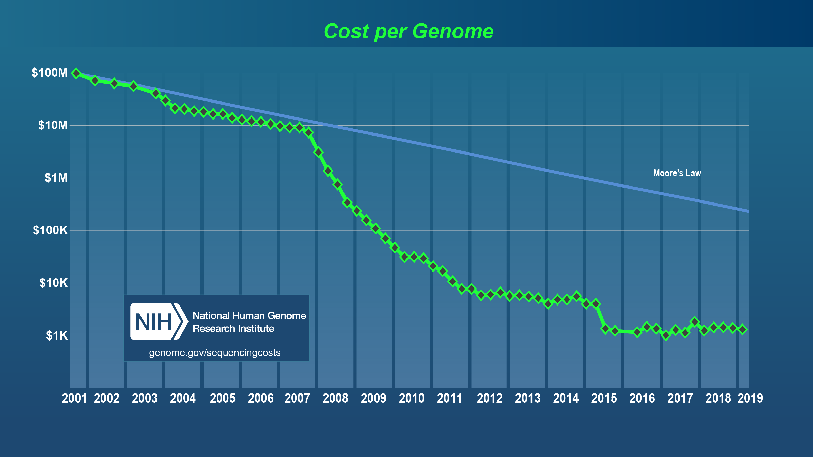
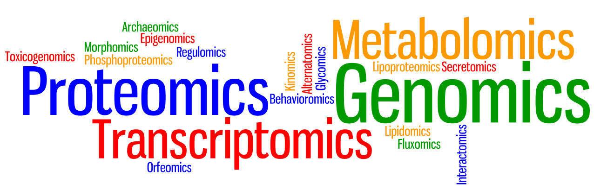

title: Introduction
speaker: Yan Li
plugins:
    - echarts

<slide class="bg-black-blue aligncenter" image="https://source.unsplash.com/C1HhAQrbykQ/ .dark">

# 01. Introduction {.text-landing.text-shadow}

---

By Yan Li,{.text-intro}

PhD in Bioinformatics, University of Liverpool{.text-intro}

<slide class="bg-light aligncenter">

## What is Bioinformatics?

---

- Genome sequencing
- Omics
- Big data
- Interdisciplinary

<slide class="bg-light aligncenter size-80">

### Genome sequencing

---

:::footer

[National Human Genome Research Institute](https://www.genome.gov/about-genomics/fact-sheets/DNA-Sequencing-Costs-Data){.alignleft}

:::

<slide class="bg-light aligncenter">

### Omics

---

<slide class="bg-light aligncenter">

### Big data

---

 
 

213,865,349 {.text-data}

Genomes in NCBI database (until Aug 2019) {.text-intro}

:::footer

[NCBI](https://www.ncbi.nlm.nih.gov/genbank/statistics/){.alignleft}

:::

<slide class="bg-light aligncenter size-50">

### Interdisciplinary

---

:::note

大部分生物信息学工作者都是生物学背景，甚至物理，化学出生的。
因为学计算机和统计挺赚钱的，不需要转生物信息学。

:::

<slide class="bg-light aligncenter">

## Application

---

- 23andme, wegene
- Infective diseases control
- Cancer Companion Diagnostics
- Gut metagenomic
- Protein structure prediction
  
<slide class="bg-light aligncenter">

## About this course

---

- All the slides will be in English
- Based on open-source softwares and resources
- Will help you master the follow skills\:
  1. Basic Linux usage and `Bash` programming
  2. Use Bioinformatic tools and Databases
  3. Basic `R` and statistics

:::note

挑选一篇paper
使用英语的目的是：1,第一次见到计算机和生物的专业名词都是英语的形式，2.习惯英语阅读，查资料时可以查阅一手的，准确的英语资料，而不是二手的，过时的，不准确的翻译中文资料，3，我的资料来源主要是英语，所以做成英文ppt对我来说容易一些

:::

<slide class="bg-light aligncenter">

## Reading

---

- [Biostar Handbook :fa-external-link:](https://www.biostarhandbook.com/)
- [生物信息学基础 :fa-external-link:](http://www.biotrainee.com/jmzeng/book/basic/)
- [生信菜鸟团 :fa-external-link:](http://www.biotrainee.com/)
  
:::note

能用计算器就能用R

:::