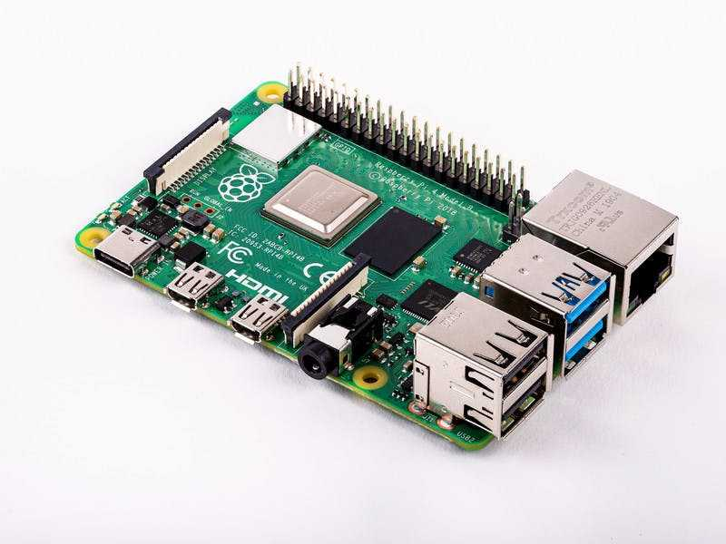
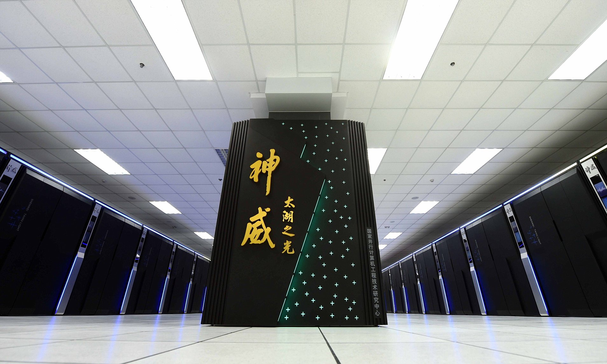

title: 02_Linux
author: Yan Li
plugins:

<slide class="bg-black-blue aligncenter" image="https://source.unsplash.com/C1HhAQrbykQ/ .dark">

# 02.Linux Basic{.text-landing.text-shadow}

---

By Yan Li{.text-intro}

PhD in Bioinformatics, University of Liverpool{.text-intro}

<slide class="bg-light aligncenter">

## Why Linux

---

- Linux is the most popular OS in the world
  - ~70% of top 10 million Alexa domains are powered by Linux (according to W3Techs)
  - from Raspberry pi to Supercomputer

:::gallery

Raspberry Pi

---

Sunway TaihuLight

:::

<slide class="bg-light aligncenter">

## Why Linux

---

- Most bioinformatic softwares are on Linux
- CLI (command-line interface) is more effecient than GUI (graphical user interface)
  - A web-based platform for non-bioinformaticians\: [Galaxy](https://usegalaxy.org/)

<slide class="size-80 bg-light aligncenter">

## Basic Linux Commands

---

### Folder Operation {.alignleft}

 
 

| Command                        | Annotation                                                                   |
|:---------------------------|:-------------------------------------------------------------------------------------------------------------|
| `pwd`                       | Print the full path of your current directory                                                               |
| `ls`                        | List the files in your directory                                                                            |
| `ls –l`                     | List the files in your directory but with “longer” information                                              |
| `cd`                        | Change directory (cd subdirectory)                                                                          |
| `mkdir dirName`             | Make a directory                                                                                            |
<slide class="size-80 bg-light aligncenter">

## Basic Linux Commands

---

### File Operations {.alignleft}

 
 

| Command                        | Annotation                                                                   |
|:---------------------------|:-------------------------------------------------------------------------------------------------------------|
| `cp filename1 filename2`    | create a copy of a file called filename1 and call the copy filename2                                        |
| `cp filename directoryName` | copy  the file filename into a directory called directoryName                                               |
| `mv file1 dirName`          |  Move a file called file into a directory called dirName                                                    |
| `mv file1 file2`           | Rename file1 and call it file2                                                                              |
| `rm filename`               | Delete a file                                                                                               |
| `rm –rf dirName`            | Delete a directory and all its contents                                                                     |

<slide class="bg-light aligncenter">

## Basic Linux Commands

---

### File read & write {size-80 .alignleft}

 
 

| Command                        | Annotation                                                                   |
|:---------------------------|:-------------------------------------------------------------------------------------------------------------|
| `cat`                       | Type a file to the screen (see also more and less)                                                          |
| `head` | Print the first 10 lines of a file |
| `tail` | Print the last 10 lines of a file |
| `less`                      | Type a file to the screen one page at a time (press q to quit, spacebar for next page, b to go back a page) |
| `touch filename`            | Create an empty file                                                                                        |
| `nano`                      | A basic text editor                                                                                         |
| `grep`                      | Search for the occurrence of a pattern                                                                      |

<slide class="bg-light aligncenter">

## Basic Linux Commands

---

### Manage processes {size-80 .alignleft}

 
 

| Command                        | Annotation                                                                   |
|:---------------------------|:-------------------------------------------------------------------------------------------------------------|
| `top`                       | List the processes running that are using the most CPU                                                      |
| `ps –u`                     | List your current processes                                                                                 |
| `kill pid`                  | Kill a process that is running where pid is the process id number                                           |
| `Ctrl-c`                   | Stop a process                                                                                              |
| `history`                  | List previous commands you have entered                                                                     |
| `clear`                     | clear the terminal screen                                                                                   |

<slide class="size-80 bg-light aligncenter">

## Useful symbols

---

| Symbols                        | Annotation             | Examples                                                      |
|:---------------------------|:-------------------------------------|:------------------------------------------------------------------------|
| ~ | Your home directory | cd ~ |
| . | current directory | ls .|
| .. | parent directory | cd .. |
| * | stand for "any character" | ls *.txt |
| > | Write the output of a command to a file | ls *.txt > output.txt |
| >> | Append the output of a command to a file | echo "New line" >> output.txt |
| \| | Use the output of a command as input of the next command | history \| grep "ls" |

<slide class="bg-light aligncenter">

## Workshop

---

- 在你的`Home`文件夹新建一个text文件，用你的用户名命名，如"username.txt"
- 在新文件的第一行写上你的名字，
- 把你的`home`文件夹地址输入到第二行
- 把这个text文件copy到我的`home`文件夹

<slide class="bg-light aligncenter">

## Reading

---

- [Linux 命令大全|菜鸟教程  :fa-external-link:](https://www.runoob.com/linux/linux-command-manual.html)
- [鸟哥的Linux私房菜  :fa-external-link:](http://cn.linux.vbird.org/)
- [Learn Bash in Y minutes  :fa-external-link:](https://learnxinyminutes.com/docs/bash/)