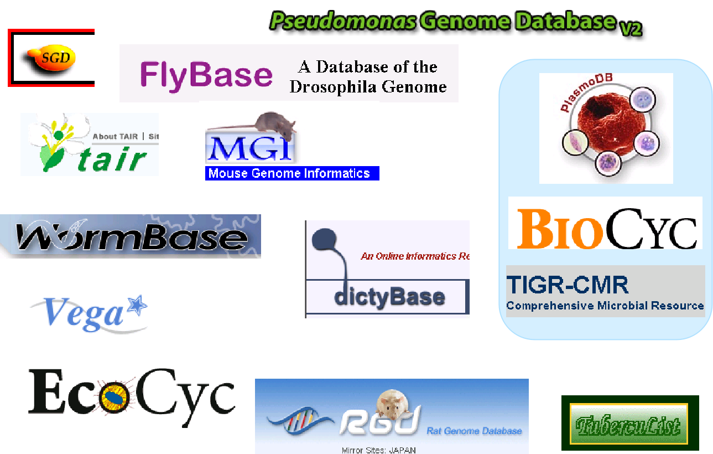
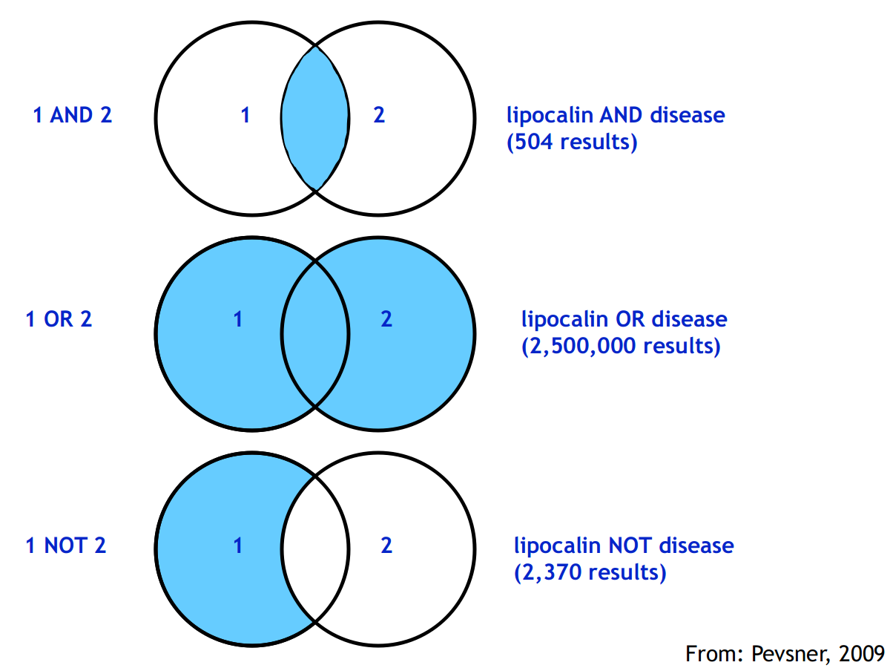
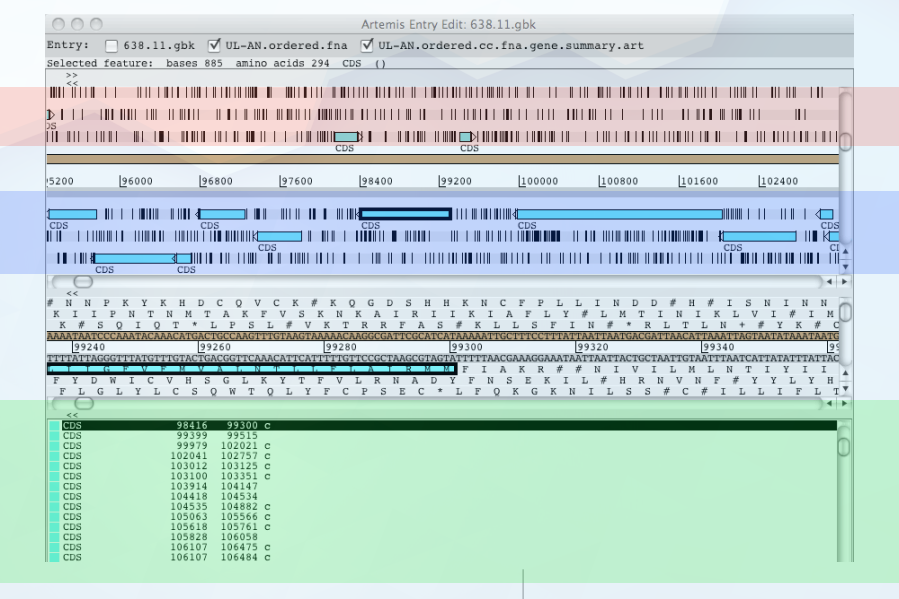

title: 04_Databases
author: Yan Li
plugins:

<slide class="bg-black-blue aligncenter" image="https://source.unsplash.com/C1HhAQrbykQ/ .dark">

# 04_Databases{.text-landing.text-shadow}

---

By Yan Li{.text-intro}

PhD in Bioinformatics, University of Liverpool{.text-intro}

<slide class="bg-light aligncenter">

## Major databases

---

- DNA sequence databases
  - **NCBI** (US GenBank)
  - EBI (European EMBL-Bank) 
  - DDBJ (Asia)
- Protein sequence database
  - **UniProtKB** (incorporates Swiss-Prot)
- Protein structure database
  - PDB
- Pathway database
  - **KEGG**
  - GO

<slide class="bg-light aligncenter">

## Specialised databases



<slide class="bg-light aligncenter">

## Boolean operators

---

- AND, OR and NOT
- Must be capitalised
- Operators are processed left to right
- e.g.\: `globin AND promoter OR enhancer`

<slide class="bg-light aligncenter">

## Boolean operators

---



<slide class="bg-light aligncenter">

## `fasta` file

---

- A header line\: `>ID description`
- Use IUPAC standard one-letter code, **nucleotides** or **amino** **acides**
- Format extension\: `fasta`, `fa`, `fna`, `faa`, etc.

```plaint
>sp|P02700|OPSD_SHEEP Rhodopsin - Ovis aries (Sheep) 
MNGTEGPNFYVPFSNKTGVVRSPFEAPQYYLAEPWQFSMLAAYMFLLIVLGFPINFLTLY 
VTVQHKKLRTPLNYILLNLAVADLFMVFGGFTTTLYTSLHGYFVFGPTGCNLEGFFATLG 
GEIALWSLVVLAIERYVVVCKPMSNFRFGENHAIMGVAFTWVMALACAAPPLVGWSRYIP 
QGMQCSCGALYFTLKPEINNESFVIYMFVVHFSIPLIVIFFCYGQLVFTVKEAAAQQQES 
ATTQKAEKEVTRMVIIMVIAFLICWLPYAGVAFYIFTHQGSDFGPIFMTIPAFFAKSSSV 
YNPVIYIMMNKQFRNCMLTTLCCGKNPLGDDEASTTVSKTETSQVAPA
```

<slide class="bg-light aligncenter">

## `GFF` file

---

- \t separated table of genome annotation

```plain
#seqid  source  type    start   end score   strand  phase   attributes
CP255_v1_chr	Bacpipe	CDS	169	255	.	+	.	ID=CP255_00001;gene_biotype=protein_coding;Name=thrL;note=blasn name thrL;
CP255_v1_chr	Bacpipe	CDS	337	2799	.	+	.	ID=CP255_00002;gene_biotype=protein_coding;Name=thrA;Dbxref=WP_001264677.1;note=bifunctional aspartate kinase/homoserine dehydrogenase I;
CP255_v1_chr	Bacpipe	CDS	2801	3730	.	+	.	ID=CP255_00003;gene_biotype=protein_coding;Name=thrB;Dbxref=WP_000241685.1;note=homoserine kinase;
CP255_v1_chr	Bacpipe	CDS	3734	5020	.	+	.	ID=CP255_00004;gene_biotype=protein_coding;Name=thrC;Dbxref=WP_000781109.1;note=threonine synthase;
```

<slide class="bg-light aligncenter">

## `genbank` file

---

- An annotation (and sequence) file format used by NCBI, gene bink,
- First 10 characters form a column of identifier,
- Followed by infomations

<slide class="bg-light aligncenter">

## Visualizing genome

---

- [Artemis :fa-external-link:](http://sanger-pathogens.github.io/Artemis/Artemis/)
- IGV [Integrative Genomics Viewer :fa-external-link:](http://software.broadinstitute.org/software/igv/)
- IGB [Integrative Genomics Browser :fa-external-link:](https://bioviz.org/)

<slide class="bg-light aligncenter">

## Artemis



<slide class="bg-light aligncenter">

## Workshop