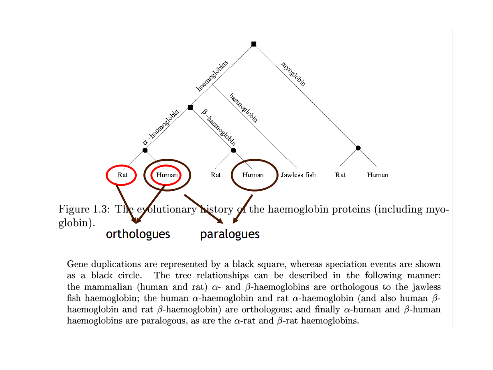
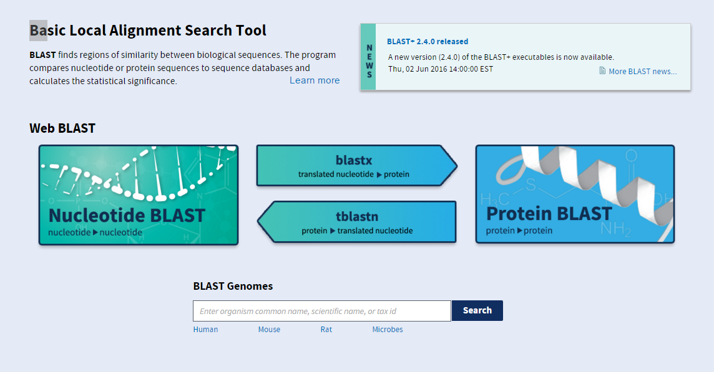
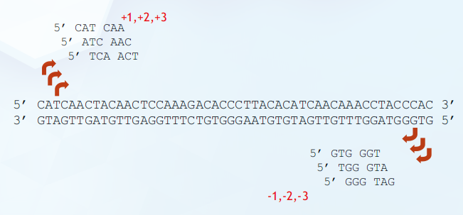
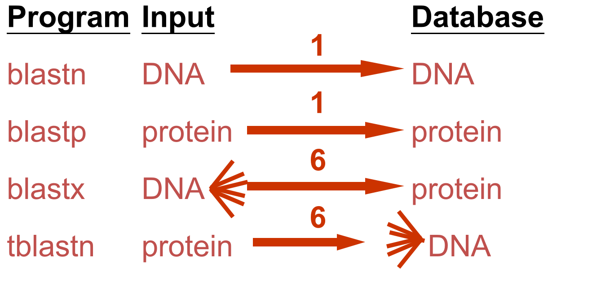
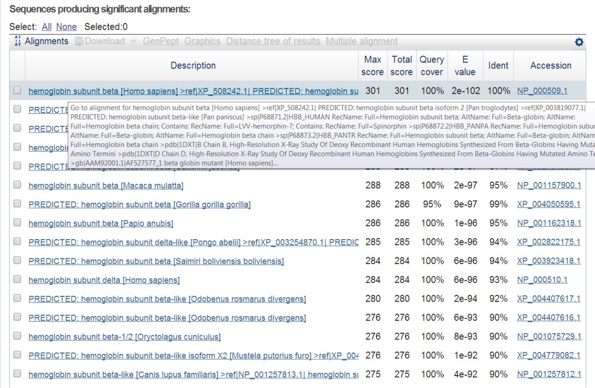
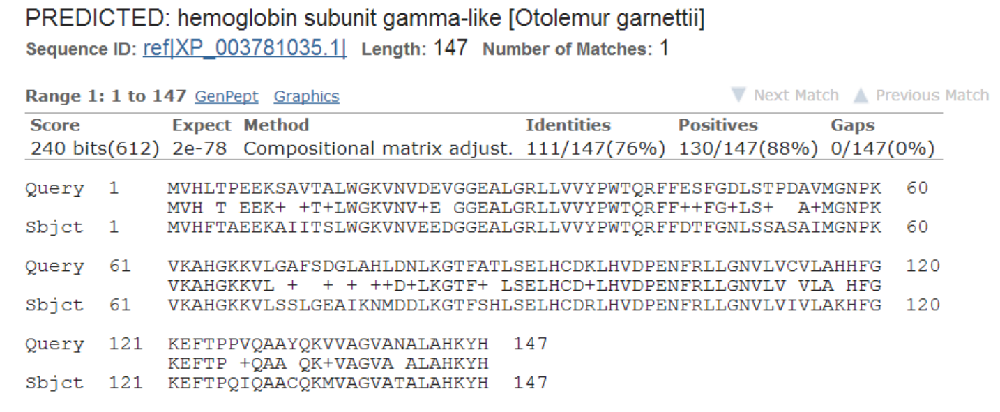

title: 05_BLAST
author: Yan Li
plugins:

<slide class="bg-black-blue aligncenter" image="https://source.unsplash.com/C1HhAQrbykQ/ .dark">

# 05_BLAST{.text-landing.text-shadow}

---

By Yan Li{.text-intro}

PhD in Bioinformatics, University of Liverpool{.text-intro}

<slide class="bg-light aligncenter">

## BLAST

---

- **B**asic **L**ocal **A**lignment **S**earch **T**ool
- Compare a **query** sequence against a **database**
- Sequence alignment\: local & pairwise

<slide class="bg-light aligncenter">

## Homology

---

- **Similarity**
- **Homology**\: diverged from a common ancestor
- **Orthologues**\: proteins that do the same function in different species
- **Paralogues**\: proteins that perform different, but related functions within one organism

<slide class="bg-light aligncenter">

## **Orthologues** vs **Paralogues**

---



<slide class="bg-light aligncenter">

## Blast program

---



<slide class="bg-light aligncenter">

## DNA potentially encodes six proteins

---



<slide class="bg-light aligncenter">

## BLAST program

---



<slide class="bg-light aligncenter">

## BLAST hit list

---



<slide class="bg-light aligncenter">

## BLAST alignment

---



<slide class="bg-light aligncenter">

## e-value

---

- Number of matches with this score one can expect to find by chance in a database of size N
- Closer to 0, the better the alignment

<slide class="bg-light aligncenter">

## blastn vs blastp

---

- Faster and more accurate to BLAST **proteins** rather than **nucleotides**. 
- If you know the reading frame in your sequence – TRANSLATE it and then BLAST

<slide class="bg-light aligncenter">

## Online BLAST workshop

---

NCBI (National Center for Biotechnology Information) server\:

[http\://www.ncbi.nlm.nih.gov/BLAST](http://www.ncbi.nlm.nih.gov/BLAST)

<slide class="size-70 bg-light aligncenter">

## local BLAST software

---

```sh
conda install -c bioconda blast
makeblastdb -in sopd_gene.fasta -dbtype nucl -out sopD
blastn -query salmonella_typhimurium_lt2.fasta -db sopD -out sopD_lt2.txt -outfmt 1
```

- Read the help document
- Make notes of all your operations
