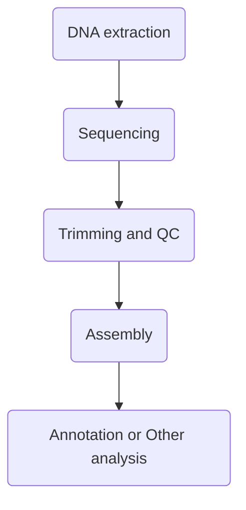
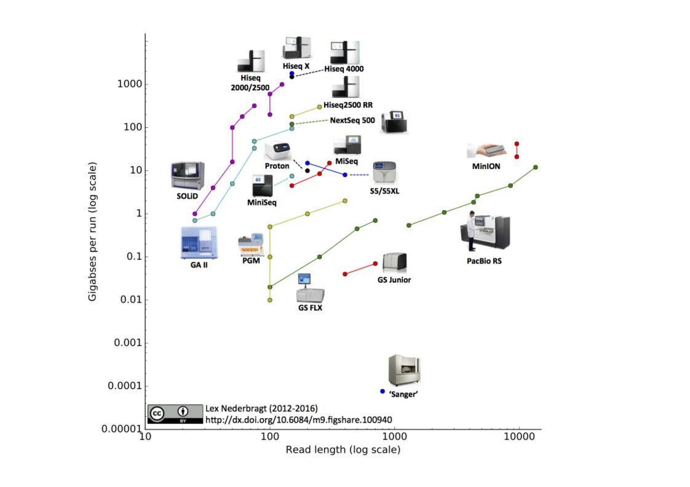
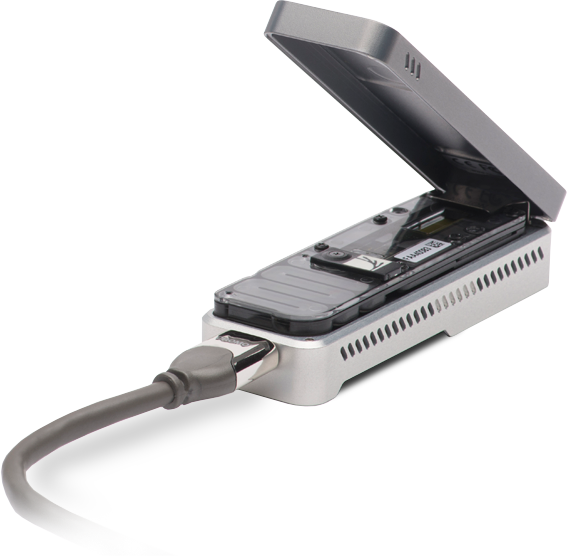
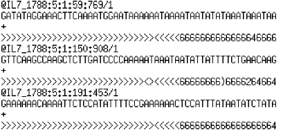
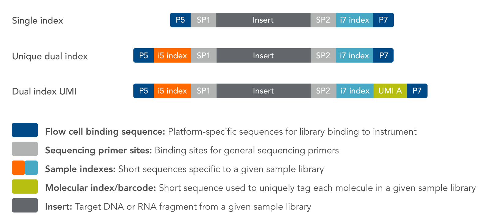

title: 05_Sequencing_and_FastQ
author: Yan Li
plugins:
    - mermaid

<slide class="bg-black-blue aligncenter" image="https://source.unsplash.com/C1HhAQrbykQ/ .dark">

# 05_Sequencing_and_FastQ{.text-landing.text-shadow}

---

By Yan Li{.text-intro}

PhD in Bioinformatics, University of Liverpool{.text-intro}

<slide class="bg-light aligncenter">

## Workflow

---


<slide class="bg-light aligncenter">

## Sequencing\: an overview

---

| Gene Sqeuencing Development | The Key Players | Key Technology | Key Product | Product Release Time |
|:------|:-------|:---------|:----------|:-------|
| Sanger's Sequencing | ABI | Chain Termination Method | ABI 3730 | 1987 |
| Next Generation Sequencing (NGS) | Illumina | Sequencing by Synthesis | Hiseq, Miseq | 2006 |
| Third Generation Sequencing | Pacific Biosciences | SMRT Technology | PacBio RS, PacBio RS II | 2013 |
| | Oxford Nanopore Technology | Nanopore Technology | MinION | 2014 |

<slide class="bg-light aligncenter size-80">

## Sequencing\: an overview

<br/>
<br/>



<slide class="bg-light" image="sanger.png .right">

:::{.content-left}

## Sanger Sequencing

---

- Fred Sanger
- 1977
- Uses extension-terminating dideoxynucleotides
- Then
  - 1st human genome
  - 13 years (1990 - 2003)
  - $2.7 billion

<slide class="bg-light aligncenter">

## [Illumina :fa-play-circle-o:](https://www.bilibili.com/video/av13107081/)

---

- Pro
  - High throughput, low cost
- Con
  - Limited read length hampers **complex genome feature** (e.g. repeats, low coverage, structural variation) reconstruction in assembly (Partially overcome by **paired-end reads** with known insert size)
  - Takes **long time**
  - Expensive infrastructure

<slide class="bg-light aligncenter">

## [PacBio :fa-play-circle-o:](https://www.youtube.com/watch?v=NHCJ8PtYCFc)

---

- Better assembly 
- Lower first pass accuracy 
- Faster because sequencing in real time
- Directly detect base modifications

<slide class="bg-light aligncenter size-80">

## [Nanopore :fa-play-circle-o:](https://www.bilibili.com/video/av50503848/)

---



<slide class="bg-light aligncenter">

## Fastq file

---

```plain
@IL7_1788:5:1:59:769/1
GTGGTCAGTGATTTGCAGGAGGGCACCGGGCCCGTAGATTGCGGCGGCTGGTTAGTGGATGTGTGCGATGCGTTAACCGATCACGCCAGTGAATTTATTGA
+
GGAGAGGG<GGIGIIGIIGGAGGGGGGGGG<AGGGGGGGGGGGGGGGGGGIGGGGGGG<GGGGGIIG<<GAG.AAGGIIIIIGGGAGGGGIGGAGGGGIAG
@IL7_1788:5:1:150:908/18
CCACGCCACAGACCGCTATCAGTCGTCCTTCGCGTATCGCACCCTTAATGTCTTTCATCAGCTGCTTATGGTGGGCAGTTTCATAATACCCGGCCTGTTCA
+
GGGGGGGIIIIIIIGIIGGGIIIGGGGGGGGGGGIGIGGGIIIIIIGGIIIIIIGGGGGIIGIGIIIIGIGGIIIGIIIIIIIGGGGIGGGGGIGGGGGGI
```

:::note



:::

<slide class="bg-light aligncenter">

## Sequence header

| Sequence header | Meaning |
|:----------------|:--------|
| @IL7_1788	| instrument name (unique) |
| 5		| flowcell lane |
| 1		| tile number within flow cell |
| 59	| x-coordinate of cluster within tile |
| 769	| y-coordinate of cluster within tile |
| /1	| member of a pair (/1/2) |

<slide class="bg-light aligncenter size-80">

## Trimming



- Need to remove all the adaptors, sequencing primer sites, indices
- Sequencing quality based trimming

:::note

https://sg.idtdna.com/pages/products/next-generation-sequencing/adapters

:::

<slide class="bg-light aligncenter">

## QC

---

[A Fastqc example :fa-external-link:](./public/SRR10561173_1_fastqc.html)

<slide class="bg-light aligncenter">

## Softwares

---

- [`trimmomatic` :fa-external-link:](https://github.com/timflutre/trimmomatic)
- [`seqtk` :fa-external-link:](https://github.com/lh3/seqtk)
- [`fastqc` :fa-external-link:](https://www.bioinformatics.babraham.ac.uk/projects/fastqc/)

<slide class="bg-light aligncenter">

## Workshop

---

We will do

- View the raw reads file
- Trim the raw reads\: `trimmomatic` and `seqtk`
- Quality assessment\: `fastqc`