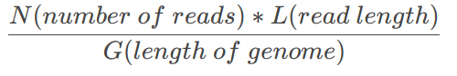
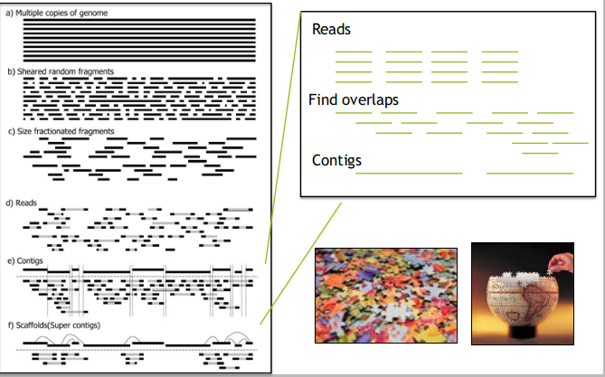
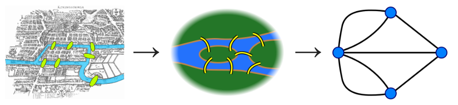
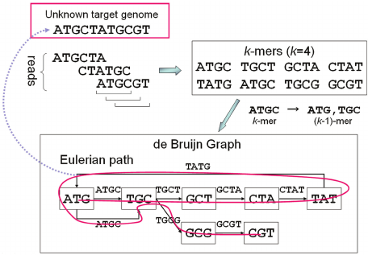
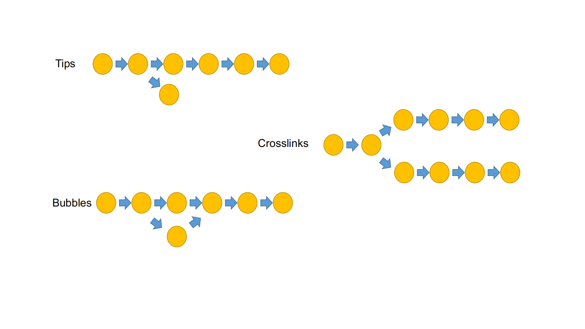

title: 07_Genome_assembly
author: Yan Li
plugins:
    - katex

<slide class="bg-black-blue aligncenter" image="https://source.unsplash.com/C1HhAQrbykQ/ .dark">

# 07_Genome_assembly{.text-landing.text-shadow}

---

By Yan Li{.text-intro}

PhD in Bioinformatics, University of Liverpool{.text-intro}

<slide class="bg-light aligncenter">

## Introduction

---

- Assembly\: from short reads to long contigs
- Two types of genome assembly\:
  - **de novo**
  - re-sequencing (reference-guided)
- We will focus on *de novo* of bacterial genome

<slide class="bg-light aligncenter">

## Why

---

- Make a reference genome (when we are not already have one)
- Look at genome structure
- Put features into context
- To make comparison to other genomes

<slide class="bg-light aligncenter">

## Technology choice

---

- Different assembler based on the sequencing platform
- PacBio & Nanopore
  - Flye
- Illumina
  - **Spades**
  - Velvet

<slide class="bg-light aligncenter">

## Factors dictate assemly quality

---

- Read length and coverage
- Sequencing data quality
- Genome complexity

<slide class="bg-light aligncenter">

## Coverage / Depth

---

- Usually expressed as 30x, 100x, etc
- Low coverage cause some genome regions have no reads
- Short reads length may make repeat regions impossible to recover 

:::note

$\frac{N(number\space of\space reads) * L (read\space length)}{G(length\space of\space genome)}$

https://katex.org/#demo

:::

<slide class="bg-light aligncenter">

## Terminology

---

| Term | Definition |
|:-----|:-----------|
| assembly | reconstructing a genome sequence from raw reads |
| read | fragments of genome generated by a sequencer |
| coverage | the average number of reads that align to known reference bases |
| contig | a contigious sequence built from overlapping reads |
| scaffold | sets of overlapping contigs separated by gaps of known length |
| graph | represents relationships using nodes and edges |

<slide class="bg-light aligncenter">

<slide class="bg-light aligncenter">

## Graph theory\: the Seven Bridges of Königsberg 

---

Can we visit each part of the city by crossing each bridge once?

<slide class="bg-light aligncenter">

## Graph theory\: the Seven Bridges of Königsberg

---

- Eulerian path = visit every edge of the graph only once
- In this problem it's impossible
  
<slide class="bg-light aligncenter">

## de Bruijn graph

---

- Reads are broken into k-mers (substrings of length k)
- A de Bruijn graph is is constructed from the k-mers\: k-mers are connected if they have k-1 shared bases
- The genome is derived using the Eulerian path through the graph
- E.G. assemblers\: SPAdes, Velvet, ABySS

<slide class="bg-light aligncenter">

## de Bruijn graph assembler

---

<slide class="bg-light aligncenter">

## Graph features

---

Use k-mer frequency to resolve these graph features:

- remove low depth kmers
- clip tips, merge bubbles, remove links
- resolve small repeats using long kmers

<slide class="bg-light aligncenter">

## K-mer size

---

- avoid using an even numbered k-mer size
  - they can lead to reverse complementing
  - affects the strand specificity of the graph
  - palindromic k-mers are avoided with an odd k
- inceasing k-mer size can resolve ambiguities
  - higher k-mer size can < number of edges and < possible paths
  - however higher k-mer size also more sensitive to sequencing errors
  - higher k-mer size means more RAM needed
- try several k-mer sizes to get the best assembly

<slide class="bg-light aligncenter">

## Assembly quality

---

We assess quality by looking at the assembly **contiguity**, **completeness** and **correctness**

<slide class="bg-light aligncenter">

## Contiguity

---

- Ideally, we want a single complete chromosome
- We measure contiguity using:
  - contig number
  - contig length (average, median and maximum)
  - N statistics (e.g. N50)
- N50 is a statistical measure of the average length of a set of contigs
  - 50% of the entire assembly is contained in contigs with length >= the N50 value

<slide class="bg-light aligncenter">

## Completeness and correctness

---

- Completeness = assembled genome size / estimated genomes size
- Correctness is a measure of the number of errors in the assembly
  - feature compressions (i.e. repeats)
  - improper contig scaffolding
  - introduced SNPs/InDels

<slide class="bg-light aligncenter">

## Workshop

---

We will do\:

- Assemble\: [`SPAdes` :fa-external-link:](https://github.com/ablab/spades)
- Quality assessment\: [`Quast` :fa-external-link:](http://bioinf.spbau.ru/quast)
- Visualise\: [`bandage` :fa-external-link:](https://rrwick.github.io/Bandage/)
- Annotation\: [`Prokka` :fa-external-link:](https://github.com/tseemann/prokka)