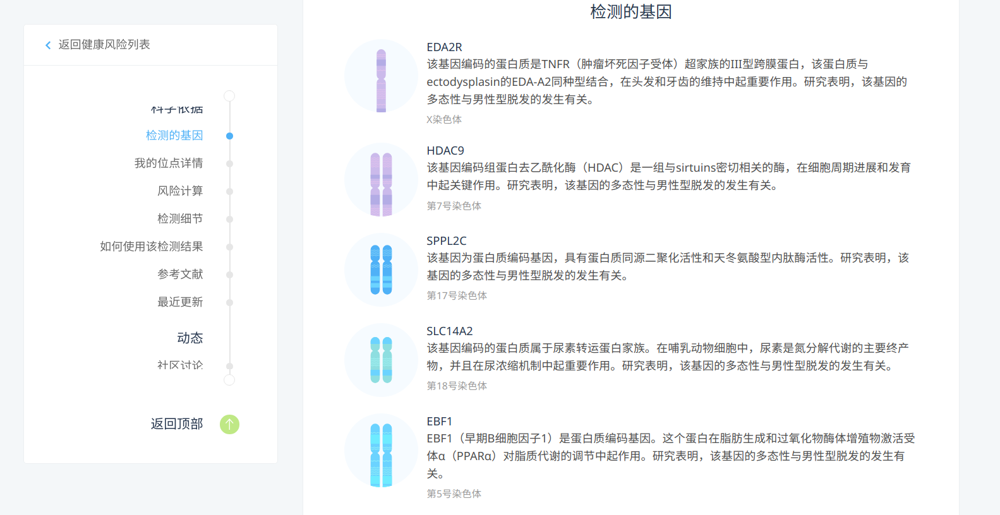
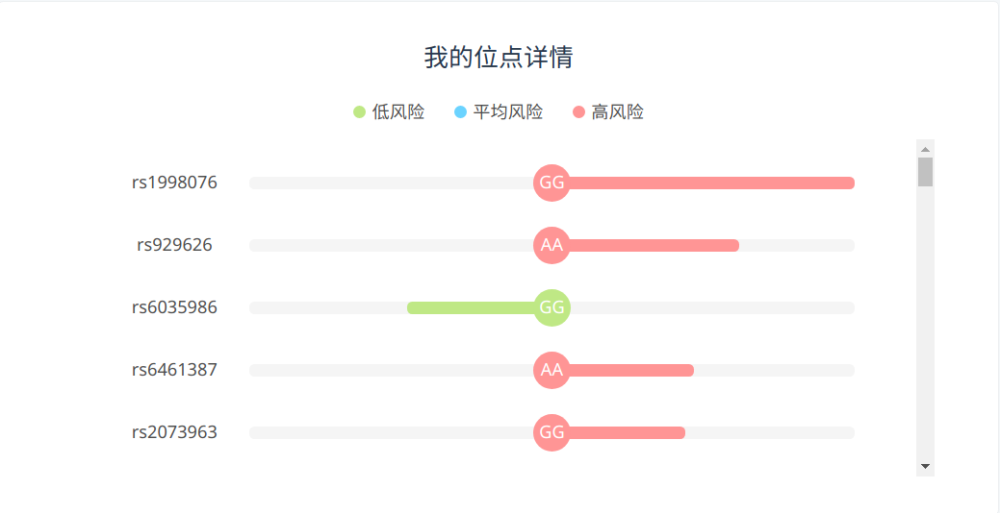
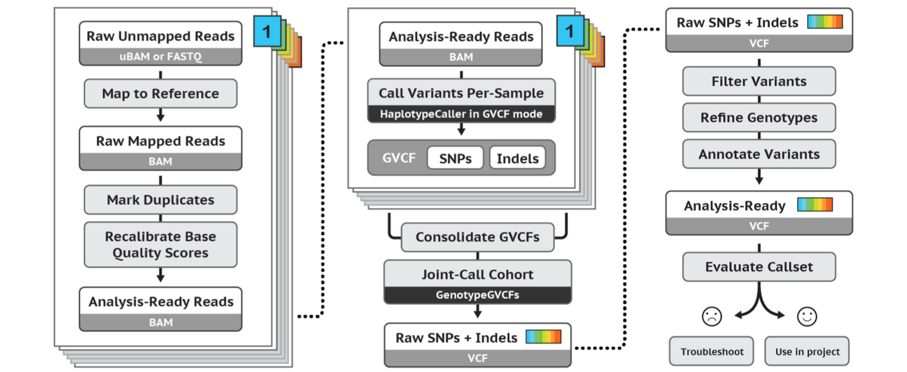
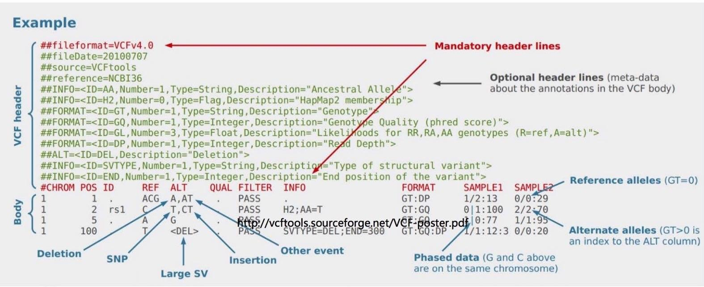

title: 08_Identify_variations
author: Yan Li
plugins:

<slide class="bg-black-blue aligncenter" image="https://source.unsplash.com/C1HhAQrbykQ/ .dark">

# 08_Identify_variations{.text-landing.text-shadow}

---

By Yan Li{.text-intro}

PhD in Bioinformatics, University of Liverpool{.text-intro}

<slide class="bg-light aligncenter">

## Why look at variation

---

- allows us to study evolution
    - phylogenetics
    - population genomics
- let us make genotype / phenotype associations
    - genome wide association studies (GWAS)
    - human disease, agriculture, genetic engineering

<slide class="bg-light aligncenter">

## The personal gene test service

---


<slide class="bg-light aligncenter">


<slide class="bg-light aligncenter">



<slide class="bg-light aligncenter">



<slide class="bg-light aligncenter">

## What is variation

---

- Single Nucleotide Polymorphisms (**SNPs**)
    - a genetic "typo" of one nucleotide (e.g. A > G)
- INsertion / DELetions (**INDELs**)
    - a string of one or more nucleotides that has been added/removed from a location in a genome (typically 1-100bp)
- Structural Variants (**SVs**)
    - a region of DNA that has been inverted / translocated / duplicated (typically >100bp)
- Mobile Genetic Elements (**MGEs**)
    - insertion / replication of retrotransposons, transposons, integrons etc.

<slide class="bg-light aligncenter">

## Workflow - GATK best practice

---



:::foot

refer to [GATK website :fa-external-link:](https://software.broadinstitute.org/gatk/best-practices/workflow?id=11145)

:::

<slide class="bg-light aligncenter">

## Shors reads allignment

---

- **bwa** (Burrows-Wheeler Aligner)
- Bowtie

<slide class="bg-light aligncenter">

## Sam/Bam files

---

- **SAM** file is a TAB-delimited, line-oriented text format, including a header section and an alignment section
  - Header section\: each line contains some metadata
  - Alignment section\: each line contains the alignment of a read
  - The [SAM tag specification](http://samtools.github.io/hts-specs/SAMtags.pdf)
- **BAM** file is the compressed format of SAM file

<slide class="bg-light aligncenter">

## An example of SAM file

---

```plain
@HD     VN:1.6  SO:coordinate
@SQ     SN:NC_003197.2  LN:4857450
@SQ     SN:NC_003277.2  LN:93933
@RG     ID:foo  PL:illumina     SM:SRR1056117
SRR10561173.6336        2209    NC_003197.2     1       60      57H44M  =       549     649     AGAGATTACGTCGGGTTGCAAGAGATCTTGACAGGGGGAATTGG    .G...G...GAA.<A.<A.GGGAGAGA.<..G...<GAA.GGAG    SA:Z:NC_003197.2,4857394,+,57M44S,60,0; MC:Z:101M       MD:Z:12T14A16   PG:Z:MarkDuplicates     RG:Z:foo        NM:i:2  AS:i:34 XS:i:0
SRR10561173.114060      163     NC_003197.2     1       60      45S56M  =       178     275     GAAAAAAAACTAACAAAATAACGTGCTGTAATTTTTAAAATAATAAGAGATTACGTCTGGTTGCACGAGATCATGACAGGGGGAATTGGTTGAAAATAAAT   GGAA<<<A.<<AGGGGAAGAGG.<<G.<<<G.GGAA..<GGA..<...AA.<AGA<<AG.GGGAG.<.<.<.<<GG.GAGG...G.<G.....<<.<.GGG   SA:Z:NC_003197.2,4857406,+,45M56S,60,0; MC:Z:98M        MD:Z:20A35      PG:Z:MarkDuplicates     RG:Z:foo        NM:i:1  AS:i:51 XS:i:0
```

<slide class="bg-light aligncenter">

## Call variants

---

- bcftools
- FreeBayes
- **GATK**
    - **GATK** v3.8 and v4.0 have some differences.
    - v4.0 merged the `picard` tools
- VarScan2

<slide class="bg-light aligncenter">

## VCF files

---



<slide class="bg-light aligncenter">

## Annotate SNPs

---

- **`snpeff`**
- `Annovar`
- `VAAST 2`

<slide class="bg-light aligncenter">

## Softwares

---

- [`bwa` :fa-external-link:](https://github.com/lh3/bwa)
- [`samtools` :fa-external-link:](https://github.com/samtools/samtools)
- [`gatk` :fa-external-link:](https://software.broadinstitute.org/gatk)
- [`snpeff` :fa-external-link:](http://snpeff.sourceforge.net/)

<slide class="bg-light aligncenter">

## Reading

---

- [gatk best practice  :fa-external-link:](https://software.broadinstitute.org/gatk/best-practices)
- [Bioinformatics file format  :fa-external-link:](http://www.biotrainee.com/jmzeng/book/basic/filetype.html#sam)
