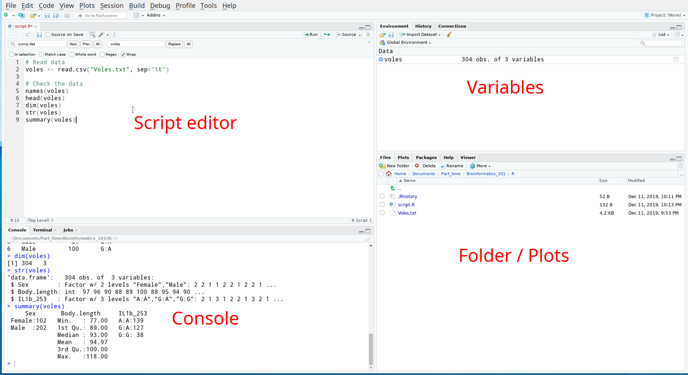
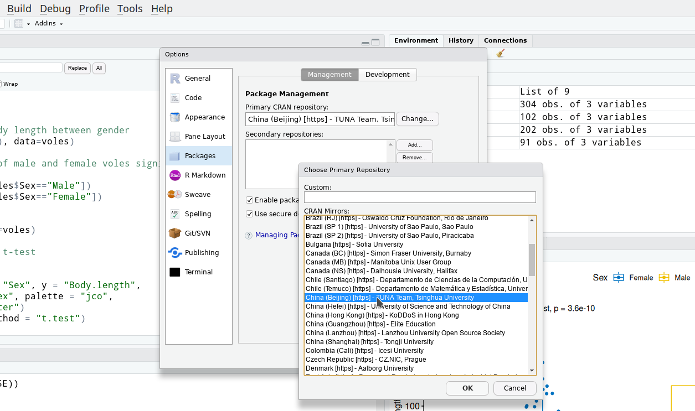

title: 09_R_introduction
author: Yan Li
plugins:

<slide class="bg-black-blue aligncenter" image="https://source.unsplash.com/C1HhAQrbykQ/ .dark">

# 09_R_introduction{.text-landing.text-shadow}

---

By Yan Li{.text-intro}

PhD in Bioinformatics, University of Liverpool{.text-intro}

<slide class="bg-light aligncenter">

## Approaching R

---

R\: an **open source** programming language for statistical analysis

- Get familar with the interface of R-studio
- Use R-studio manage package
- Use R to perform a t-test
- Use R to visualise data

<slide class="bg-light aligncenter">

## R-studio



<slide class="bg-light aligncenter">

## Set working directory

---

- Click `Session` - `Set Working Directory` - `Choose Directory`
- Or simply use cmd `setwd("your/working/directory")`

<slide class="bg-light aligncenter">

## Import data and check

---

```r
# Read data
voles <- read.csv("Voles.txt", sep='\t')

# Check the data
names(voles)
head(voles)
summary(voles)
```

<slide class="bg-light aligncenter">

## Subset

---

```r
volesmh <- subset(voles, Sex=="Male" & IL1b_253=="G:A")
summary (volesmh)
```

<slide class="bg-light aligncenter">

## Simple plot

---

```r
barplot()
boxplot()
hist()
plot()
pie()
```
...

<slide class="bg-light aligncenter">

## Simple statistic

---

```r
mean()
median()
sd()
sum()
t.test()
```

<slide class="bg-light aligncenter">

## Change CRAN mirror

---

- Click `Tools` - `Global options` - `Packages`
- Change CRAN repo to TUNA



<slide class="bg-light aligncenter">

## Package

---

```r
install.packages("ggplot2")
require("ggplot2")
```

<slide class="bg-light aligncenter">

## Workshop

---

- Copy the dataset `worms.txt` to you laptop.
- Test this hypothesis\: Whether there is a statistically significant difference of **worm density** between in **damp field** and in **dry field**.

<slide class="bg-light aligncenter">

## Reading

---

- [w3cschool :fa-external-link:](https://www.w3cschool.cn/r/)
- [Learn R in Y minutes :fa-external-link:](https://learnxinyminutes.com/docs/r/)