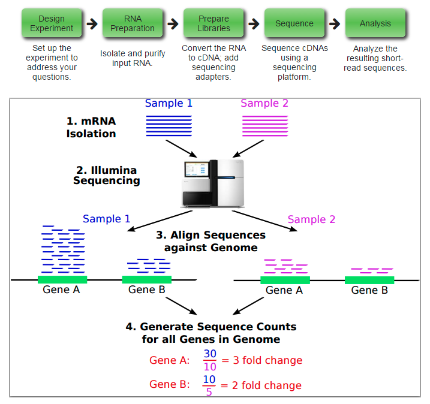

title: 10_DE_analysis
author: Yan Li
plugins:

<slide class="bg-black-blue aligncenter" image="https://source.unsplash.com/C1HhAQrbykQ/ .dark">

# 10_DE_analysis{.text-landing.text-shadow}

---

By Yan Li{.text-intro}

PhD in Bioinformatics, University of Liverpool{.text-intro}

<slide class="bg-light aligncenter">

## RNA-seq

<slide class="bg-light aligncenter">

## Popular software

---

- Mapping\: `Tophat2`, `HISAT2`
- Reads counting\: `HTSeq-counts`, `Cufflink`
- Defferential Expressing analysis\: `EdgeR`, `DEseq2`, `limma`
- GO enrichment\: `DAVID`, `g.profiler`

<slide class="bg-light aligncenter">

## Terminology

---

- RPKM\: Reads Per Kilobase per Million mapped read. 
    - RPKM = 10^9 * N / L  * 1 / C
    - N\: the total number of reads mapped to a transcript
    - C\: the number of reads mapped to a gene
    - L\: the length of the gene
- GO\: Gene ontology

<slide class="bg-light aligncenter">

## Basic Statistics

---

- P-value and False discovery rate (FDR) adjusted p values
   - a p-value of 0.05 implies that 5% of all tests will result in false positives. 
   - An FDR adjusted p-value (or q-value) will result in fewer false positives.
- Fold Change
  - Fold change is a measure describing how much a quantity changes going from an initial to a final value.

<slide class="bg-light aligncenter">

## Demonstration and Workshop