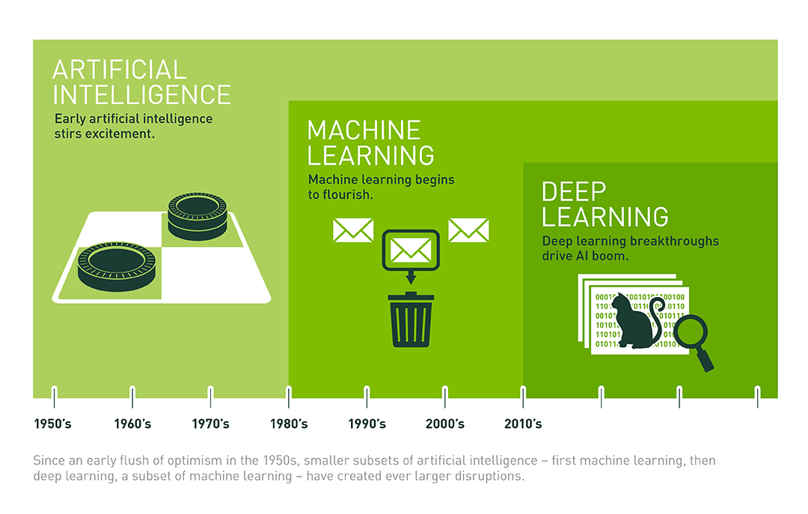

title: 12_Chat
author: Yan Li
plugins:

<slide class="bg-black-blue aligncenter" image="https://source.unsplash.com/C1HhAQrbykQ/ .dark">

# 12_Chat{.text-landing.text-shadow}

---

By Yan Li{.text-intro}

PhD in Bioinformatics, University of Liverpool{.text-intro}

<slide class="bg-light aligncenter">

## Python

---

- [`pandas` :fa-external-link:](https://pandas.pydata.org/pandas-docs/stable/10min.html)
- [`Biopython` :fa-external-link:](http://biopython.org/DIST/docs/tutorial/Tutorial.html)
- Web development
  - `Django`, `Flask`
- Machine learning & Deep learning
  - `sklearn`, `TensorFlow`, `Pytorch`

<slide class="bg-light aligncenter">

## Machine learning, Deep learning and AI

<slide class="bg-light aligncenter">

## ML vs DL

<slide class="bg-light aligncenter">

> "Data is the 21st century's oil"
> ==Joe Kaeser, Siemens CEO==

